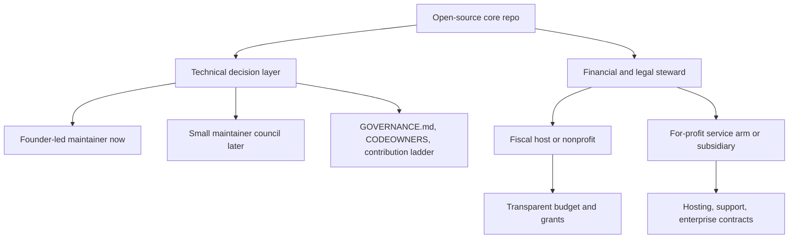
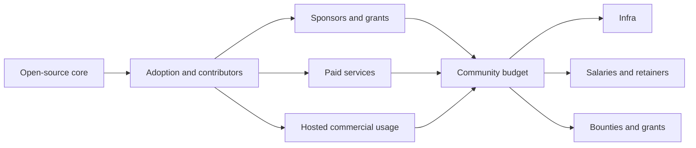

# Monetization and Governance Options for Build and QuestBoard

## Executive summary

Build is currently best understood as an early-stage, MIT-licensed, documentation-heavy open-source community repo rather than a mature software business. The public repository shows a small but active surface area with 59 commits, 6 stars, 1 fork, 5 issues, 2 pull requests, no published releases, no packages, and a visible root consisting mostly of Markdown files plus a simple `index.html` and `styles.css`; GitHub currently classifies the code footprint as HTML and CSS. The README positions Build as an open-source “learn-by-shipping” community for people building with agents, and it explicitly leaves revenue and the possibility of an NGO/nonprofit structure as open questions. citeturn1view0

The attached Quest Board concept expands that community into a potentially much more monetizable product category: a GitHub-native, spec-first board for proposing, ranking, building, and launching projects with humans and AI agents. That points to a strong strategic separation between an **open-source core** and **paid convenience, stewardship, and commercial services**. In plain terms, the cleanest path is not selling access to the code. It is selling hosting, private/commercial use, implementation, training, support, and possibly a marketplace layer while preserving the core as truly open. fileciteturn0file0 citeturn1view0turn33view0turn34view0turn8view0

If the goal is to preserve a Linux or Wikipedia style ethos, the best near-term options are: recurring sponsorships and donations, transparent fiscal hosting, paid founder or operator services, and a hosted commercial offering for startups and companies running private projects. Those models monetize **convenience, trust, speed, compliance, and outcomes** rather than restricting source access. By contrast, dual licensing or source-available restrictions are legally possible, but they are a poor fit for the current MIT setup and community positioning unless Build decides very early that it wants contributor agreements and future relicensing leverage. citeturn14view0turn17view0turn31view0turn32view0turn18view0turn19view1turn40view0

On governance, the main risk is not “open source” by itself. The real risk is **ambiguous authority**. Open projects avoid design-by-committee by making technical decision rights explicit. For Build, the most robust sequence is: founder-led maintainer authority now, a published governance file and contributor ladder soon, a small maintainer or steering council when activity expands, and only later a board-level nonprofit/foundation or hybrid structure once money, trademarks, or staff matter enough to justify it. Apache shows how meritocratic technical governance can coexist with foundation oversight, while Wikimedia shows how a mission-first nonprofit can combine board control with meaningful community-selected representation. citeturn36view0turn23view2turn43view0turn43view1

A nonprofit does **not** mean nobody gets paid. In U.S. tax guidance, tax-exempt organizations may pay reasonable compensation for services, but they cannot allow net earnings to inure to private individuals, and unrelated commercial activity can trigger unrelated business income tax. That means Build can absolutely compensate contributors or staff under a nonprofit structure, but it needs compensation policies, conflict controls, and mission alignment. citeturn30view0turn30view2turn26view1

My bottom-line mapping is simple: keep the core repo open and permissive, avoid relicensing drama, test demand with **sponsorship + hosted private beta + paid implementation or mentorship services**, and only choose a heavier legal or governance structure once at least one of these is true: recurring cash flow exists, trademarks matter, or contributor compensation becomes meaningful enough that informal handling would create trust problems. citeturn36view0turn40view0turn37view0

## What Build appears to be today

Build’s current public surface supports a business strategy that is still exploratory. The README defines the project as an open-source community learning by shipping with AI agents, centered initially on a real MVP effort. The same README also says revenue is uncertain, notes that learning and real-world impact are the primary objectives, and explicitly raises the possibility that revenue could be recycled back into an NGO or not. That is important: the repository itself already frames monetization as optional and unresolved, so this report is best read as an **option map**, not a business plan. citeturn1view0

The repository inventory suggests that Build is still in a “belief formation and operating system design” stage rather than a “priced product with strong lock-in” stage. The visible root includes `README.md`, `LICENSE`, `METHODOLOGY.md`, `TEAM.md`, `TOOLS.md`, a handful of other Markdown notes, and a simple HTML/CSS site. The repo has no published releases and no packages. The visible root listing also does not show a package manager manifest such as `package.json`, `pyproject.toml`, `Cargo.toml`, or `go.mod`, so the dependency surface appears light at the repo root today. That lowers immediate compliance complexity, but it also means the most realistic first monetization is around **community, services, and hosting**, not proprietary feature gating inside a complex codebase. citeturn1view0

The attached Quest Board notes make the strategic opportunity much clearer. They describe Quest Board as a GitHub-native, spec-first system where text files are the source of truth, GitHub provides collaboration primitives, and the platform helps projects move from idea capture through validation, contribution, build, and launch. That architecture is unusually compatible with an open core because the value can sit in multiple layers: the open repo, hosted workflows, automation, curation, launch kits, matching, enterprise administration, and services. In other words, QuestBoard is not just a “project” inside Build. It is a likely **monetization substrate** for Build. fileciteturn0file0

The obvious user segments for the report are therefore threefold. First, open-source projects and communities that want a free, GitHub-native coordination layer. Second, startups or founder teams that want the same workflow but hosted, supported, and optionally private. Third, enterprises or mission-driven organizations that care about compliance, single sign-on, auditability, support levels, onboarding, and policy controls, which is the same progression visible in public open-core and hosted OSS businesses such as GitLab, OpenProject, Sentry, and Mattermost. citeturn1view0turn33view0turn34view0turn34view2

| Inventory area | Current evidence | Strategic implication | Source |
|---|---|---|---|
| License | MIT license | Maximizes reuse and contribution. Also weakens future exclusivity unless contributor rights are managed early | citeturn1view0turn39view0turn40view0 |
| Repo surface | Mostly Markdown docs plus `index.html` and `styles.css` | Current asset is more methodology/community/product concept than software moat | citeturn1view0 |
| Dependency footprint | No package manifest visible in current root listing; GitHub reports HTML/CSS languages | Services and hosting are more realistic than code-license monetization right now | citeturn1view0 |
| Traction | 59 commits, 6 stars, 1 fork, 5 issues, 2 PRs | Promising but too early for aggressive monetization assumptions | citeturn1view0 |
| Current positioning | “Learn by shipping” open-source community for builders using agents | Community legitimacy is part of the core asset and should not be casually traded away | citeturn1view0 |
| QuestBoard concept | GitHub-native, spec-first project lifecycle and launch system | Strong candidate for a free core plus paid hosted and service layers | fileciteturn0file0 |

A practical assumption for the rest of this report is that team size, budget target, and jurisdiction are still open-ended. Where legal structure is discussed, U.S. forms are used as the reference point because the official primary-source material is clearest there, and because many OSS foundations and sponsorship structures use those frameworks. This is strategy analysis, not legal advice.

## Monetization options that preserve an open-source core

The cleanest framing is to distinguish between models that monetize **the commons**, models that monetize **the operation of the commons**, and models that monetize **commercial use around the commons**. Build should strongly prefer the latter two. The reason is not moral purity. It is leverage. Open source works best here if the free layer accelerates adoption, contribution, brand legitimacy, and experimentation, while paid layers serve users who need speed, reliability, curation, privacy, or accountability. That is the pattern visible in public open-core and hosted OSS businesses. citeturn8view0turn32view0turn33view0turn34view0turn36view0

| Model | How it works for Build or QuestBoard | Comparable public example | Revenue potential | Community impact | Implementation complexity | Legal and licensing constraints |
|---|---|---|---|---|---|---|
| Donations and grants | Accept one-off donations and grants to support the open mission, infra, community ops, and experiments | Mozilla openly solicits donations and publishes annual reports and Form 990s; Open Source Guides notes projects can use fiscal sponsors when handling donations citeturn22view0turn37view0turn36view0 | Low to medium | Strongly positive | Low | Works best with nonprofit or fiscal-hosted structure |
| Recurring sponsorships | Fund maintainers or the project via GitHub Sponsors tiers and sponsor pages | GitHub Sponsors supports one-time and monthly tiers, payouts to bank or fiscal host, and 100% of personal-account sponsorships goes to recipients; org sponsorships can carry up to 6% fees citeturn13view0turn14view0turn31view0turn12view0 | Medium | Positive | Low | Excellent for personal monetization; weak as sole company-scale model |
| Transparent collective budget | Run money through Open Collective or a fiscal host with visible inflows and outflows | Open Collective keeps collectives free, supports host fees, and emphasizes transparent budgets; its March 2026 organization pricing is activity-based and platform tips can keep collectives free citeturn15view0turn16view0turn16view1turn17view0 | Low to medium | Strongly positive | Low to medium | Great for trust, weaker for large-scale software margins |
| Hosted SaaS for private or commercial projects | Keep OSS self-hosting free, charge for hosted QuestBoard for private repos, commercial workflows, backups, support, and admin controls | GitLab offers Free and paid SaaS tiers; OpenProject offers free Community and paid cloud or on-prem enterprise tiers; Sentry offers free plus paid hosted plans citeturn8view0turn32view0turn33view0turn34view0 | High | Positive if self-hosted core stays free | Medium to high | Best fit for OSS ethos if code remains open |
| Premium enterprise features around the hosted service | Sell SSO, audit logs, compliance exports, SLA-backed support, policy controls, onboarding, security integrations | GitLab Premium and Ultimate, OpenProject enterprise tiers, and Sentry business or enterprise tiers all monetize admin, security, support, and governance features citeturn8view0turn33view0turn34view1 | High | Mixed but acceptable if core remains useful | Medium to high | Safer if premium value is operational rather than core collaboration logic |
| Consulting, implementation, and founder mentorship | Paid help designing workflows, setting up QuestBoard, launch support, AI-agent operations, product strategy, contributor operations | GitHub points to expert services; GitLab and Elastic both sell services and consulting alongside product access citeturn12view0turn8view0turn18view0 | Medium to high | Positive | Low to medium | Strong fit for personal monetization and early cash flow |
| Training and certification | Paid workshops, cohorts, office hours, maintainer bootcamps, enterprise certification for operators | GitLab and Elastic both offer training/certification ecosystems, though public pricing varies by program and region citeturn8view0turn18view0 | Medium | Positive | Medium | Good adjunct business, usually not the first revenue engine |
| Marketplace take rate | Match projects with paid contributors, launch kits, agents, templates, integrations, or mentors, and take a percentage | GitHub Marketplace shows the logic of an ecosystem layer, though not the exact same use case citeturn12view0 | Medium to high if network effects emerge | Mixed | High | Best only after Build has real supply and demand |
| Dual licensing or source-available protection | Keep community edition open, sell commercial rights or restrict managed-service competition | GitLab CE is MIT while EE has more restrictions; Elastic uses ELv2 and source-code choice under SSPL and AGPL for parts, with explicit managed-service restrictions under ELv2 citeturn32view0turn18view0turn19view1turn19view2 | Medium to high | Often negative | High | Poor fit with current MIT posture unless contributor rights are controlled early |

The strongest fit for Build today is a **three-lane stack**. Lane one is community funding and legitimacy through GitHub Sponsors, donations, grants, and a transparent collective budget. Lane two is personal monetization through implementation, founder coaching, workflow design, concierge launch support, and training. Lane three is a hosted commercial offering for private or for-profit teams that want the QuestBoard workflow without running it themselves. Those three lanes can coexist cleanly with an open-source core. citeturn14view0turn17view0turn33view0turn34view0

By contrast, dual licensing or source-available shifts should be treated as a later-stage defensive option, not a default plan. They solve a real problem for some companies, especially when cloud vendors resell the project as a service, but they also change the social contract. Elastic’s own materials explicitly show the restrictive edge of ELv2, including a ban on providing the product as a managed service and license-key protections. That may make business sense in some contexts, but it is not the same thing as a Wikipedia or Linux style commons. citeturn18view0turn19view1turn19view2

An important nuance is that GitHub Sponsors is unusually good for the personal-value concern your teammate raised. GitHub allows sponsorship tiers, pays out through bank or fiscal host, recognizes a wide range of contributions beyond code, and personal-account sponsorships pass through without a GitHub fee. That makes it a credible way to support individual maintainers or visible operators even before Build becomes a company-scale product. citeturn13view0turn14view0turn31view0

The most realistic illustrative pricing for a hosted or enterprise QuestBoard should be anchored below GitLab’s higher-end dev-platform pricing and roughly in line with lighter collaboration or hosted-ops tools. Public comparables span from OpenProject’s Community free tier to €5.95, €10.95, and €15.95 per user per month for paid plans, Sentry’s $26 and $80 monthly paid tiers for hosted use, and GitLab’s $29 per user per month Premium plan. That suggests Build can test paid willingness without overpricing the earliest version. citeturn33view0turn34view0turn8view0

| Illustrative QuestBoard tier | Intended customer | Illustrative price | What is paid for | Public anchors |
|---|---|---|---|---|
| Community Self-Hosted | OSS projects and public communities | Free | Core open-source software, public boards, basic automations | GitLab Free, OpenProject Community, Sentry Developer citeturn8view0turn33view0turn34view0 |
| Hosted Starter | Small startups or founder teams | $49 to $99 per org per month | Managed hosting, private projects, backups, email support, easy setup | Anchored below Sentry Team and GitLab Premium, above pure OSS free tiers citeturn34view0turn8view0 |
| Hosted Growth | Startups and agencies with multiple private projects | $199 to $499 per org per month | SSO, deeper analytics, audit trails, reusable templates, team permissions, workflow policy controls | OpenProject paid enterprise ladder, Sentry Business, GitLab team-oriented pricing citeturn33view0turn34view1turn8view0 |
| Enterprise | Enterprises, NGOs, accelerators, universities | $1,500 to $5,000+ per month plus onboarding | SLA, support, compliance exports, procurement, onboarding, security review, dedicated roadmap input | Enterprise custom sales patterns in GitLab, Sentry, Mattermost, OpenProject citeturn8view0turn34view1turn34view3turn33view0 |

These prices are not recommendations. They are validation hypotheses. The important strategic point is that the paid object should be **hosting and stewardship**, not access to the core open workflow.

## Governance structures that avoid design by committee

Governance should be designed as a way to preserve speed, not to signal virtue. GitHub’s own Open Source Guides are blunt on this: growing projects benefit from formal decision rules, and open-source projects commonly use maintainers, committers, and explicit governance structures. The same guide identifies BDFL, meritocracy, and liberal-contribution structures as common patterns, while Apache’s official governance documents show how project-level technical autonomy can coexist with a foundation board that manages assets, trademarks, and corporate affairs. citeturn36view0turn23view2

For Build, the core governance challenge is straightforward. The community likely wants open participation, but the product is still vision-led. That means a **founder-led technical authority with documented process** is not a flaw. It is probably the right starting point. The anti-pattern would be pretending decisions are purely communal before the project has the contributor depth, conflict norms, and leadership systems to make that work. Apache’s model works because merit, roles, and project management committees are spelled out. Wikimedia’s works because board authority, community-selected trustees, and fiduciary duties are spelled out. Ambiguity, not openness, is what creates committee paralysis. citeturn23view0turn23view1turn43view0turn43view1

| Governance model | How it works | Decision speed | Community legitimacy | Compensation fit | Main friction point | Official anchor |
|---|---|---|---|---|---|---|
| Benevolent dictator | One lead maintainer has final say on major decisions | High | Medium early, lower later if opaque | Easy | Bottleneck and succession risk | Open Source Guides describes BDFL as common and often default for small projects citeturn36view0 |
| Meritocratic maintainer model | Contributors earn authority through repeated contribution | Medium | High among contributors | Good | Can feel insider-heavy without clear criteria | Apache calls this “government by merit” and uses committers and PMCs citeturn23view0turn23view1 |
| Foundation or nonprofit with technical committee | Board manages assets and mission; technical group steers product | Medium | High if transparent | Good, with guardrails | More admin and fiduciary overhead | Apache foundation governance and Wikimedia board-and-community representation citeturn23view2turn43view0turn43view1 |
| Corporate-backed steward | Company employs maintainers and drives roadmap while accepting outside contributions | High | Mixed | Very good | Community may fear capture or roadmap bias | Open Source Guides notes that company-launched projects often designate internal teams to manage projects citeturn36view0 |
| DAO | On-chain voting, treasury, collective ownership structure | Low to medium in practice | Polarizing | Possible but operationally heavy | Legal uncertainty, voter apathy, token politics | Ethereum describes DAOs as collectively owned, rule-based organizations without centralized leadership citeturn23view3 |

The best-fit governance path for Build is probably staged rather than ideological.

| Stage | Practical governance choice | Why it fits Build now |
|---|---|---|
| Early | Founder-led maintainer with explicit `GOVERNANCE.md`, `CODEOWNERS`, and a contribution ladder | Preserves vision and speed while making authority legible |
| Growth | Small steering or maintainer council chosen by contribution and trust | Reduces founder bottleneck without diffusing judgment too early |
| Revenue-bearing | Separate legal or fiduciary layer for money, contracts, trademarks, and compensation | Prevents governance confusion between code decisions and budget decisions |
| Mature public-interest version | Foundation or fiscal-hosted structure with some community-selected seats and annual transparency | Best match for a Wikipedia-like legitimacy model if Build becomes infrastructure |

Contributor compensation should also be made explicit early, even if the amounts are tiny. The moment money appears, people will interpret silence as politics. The available mechanisms are not exotic: salaries or contractor retainers for core maintainers, bounties for well-bounded deliverables, grants or fellowships for exploratory work, sponsor earmarks for specific contributors, and revenue-share or commission structures for marketplaces or service referrals. The right mechanism depends less on ideology than on what is actually being paid for. Sponsors and grants are excellent for mission work and visible stewardship; salaries are best for continuity; bounties are best for discrete tasks; revenue share fits commercial service layers better than nonprofit core stewardship. citeturn12view0turn14view0turn15view0turn17view0turn30view0turn26view1

The main design principle is to separate **technical authority** from **budget authority**. Apache does this explicitly: the board manages corporate assets and resources, while project PMCs have technical decision-making authority. Wikimedia similarly places business affairs under the board while allowing community-linked trustee selection. Build should copy that separation long before it copies any specific bylaws. citeturn23view2turn43view1

## Legal structure and licensing implications

Open Source Guides states a useful default: you generally do not need a legal entity unless you are handling money. That makes fiscal sponsorship the lightest serious option. It lets Build accept donations, GitHub Sponsors payouts, grants, and expenses without immediately choosing between a company and a nonprofit. GitHub explicitly supports fiscal-host payouts for Sponsors and lists hosts such as Open Source Collective, NumFOCUS, and the Python Software Foundation. For an early public-good project, that is usually the fastest credible move. citeturn36view0turn31view0

| Structure | What it enables | Compensation | Advantages | Constraints | Relevant example |
|---|---|---|---|---|---|
| Fiscal host, no new entity yet | Donations, sponsorship payouts, grants, transparent expenses | Yes | Fastest path, low admin burden, strong community trust | Host policies and fees; less control than own entity | GitHub Sponsors fiscal-host support and Open Collective hosting model citeturn31view0turn16view0turn17view0 |
| Nonprofit 501(c)(3)-style model | Donations, grants, mission spending, publicly accountable governance | Yes, if reasonable | Best for public-interest legitimacy and grant fit | Private inurement restrictions, mission alignment, UBI tax risk | Apache is a 501(c)(3); Mozilla publishes 990s and audited financials; Wikimedia bylaws show board governance and free public mission citeturn23view0turn37view0turn43view1 |
| For-profit LLC or C-Corp | SaaS, services, enterprise contracts, equity investment | Yes | Fastest for commercial scaling and private-project productization | Perceived community capture risk; weaker donation and grant story | Open Source Guides recommends LLC or C-Corp when creating a commercial business citeturn36view0 |
| Hybrid nonprofit plus taxable subsidiary | Public mission at the top, commercial arm below | Yes | Strongest separation between commons and commerce | More setup, governance complexity, inter-entity discipline required | Mozilla Foundation is parent of Mozilla Corporation and publishes foundation records and financials citeturn22view0turn37view0 |
| Later-stage project foundation | Trademark, policy, grants, board governance, ecosystem stewardship | Yes | Useful when Build becomes infrastructure beyond one project | Overkill for now | Apache and Wikimedia are mature foundation examples citeturn23view2turn43view1 |

The user instruction about nonprofit compensation is correct in substance. IRS guidance makes two points that matter here. First, tax-exempt organizations may pay **reasonable compensation** for services, and IRS Publication 557 defines reasonable compensation as what like enterprises would ordinarily pay for like services under like circumstances. Second, tax-exempt organizations cannot allow net earnings to inure to private individuals, and commercial activity that is not substantially related to the exempt purpose can generate unrelated business income tax. So the right interpretation is not “nonprofits cannot pay people.” It is “nonprofits can pay people, but must do so with process, comparability, and mission discipline.” citeturn30view0turn30view2turn26view1

Licensing is the most sensitive part of the strategy because Build already ships under MIT. GitHub’s own licensing guidance notes that without a license, default copyright applies; with a permissive license like MIT, others may use, change, and distribute the software subject to the license terms. Open Source Guides goes further: MIT is easy to start with and even makes later license changes easier **if** the relevant copyright holders agree, but changing licenses becomes complicated once many contributors hold copyright. It explicitly warns that license changes are governance events, and that if you want dual licensing or proprietary distribution later, you may need contributor agreements or copyright assignment up front. citeturn39view0turn40view0

That has a direct implication for Build. If you want a truly open commons, staying MIT and monetizing hosting, services, and enterprise operations is the least friction path. If you think there is a serious chance you will want dual licensing later, that needs to be planned **now**, before there are many external contributors, because otherwise relicensing becomes slow and politically painful. Mozilla’s historical relicensing is one example that took years, and Open Source Guides explicitly notes that large projects can face a long and complicated contributor-rights exercise. citeturn40view0

Elastic is the useful cautionary contrast. Elastic’s current official materials show a source-code choice model involving SSPL, AGPL for parts of the source, and ELv2 for distributions, with ELv2 restricting managed-service offerings and license-key circumvention. That is a coherent vendor-protection strategy, but it is not the same thing as a Linux-style permissive open core. If preserving open-source charm and contributor leverage is central, Build should treat that family of options as a strategic last resort, not a default. citeturn18view0turn19view1turn19view2

## Recommended experiments to validate revenue without locking in

The most important move now is not incorporation. It is evidence. Build should test whether people will pay for **support, hosting, and outcomes** before it commits to a heavier legal structure or a more restrictive license. Because the repo is still early, the cheapest route is to validate willingness to pay with offers that can be delivered manually before automating them. That is exactly how many open-source businesses discover which layer of value users actually want. citeturn1view0turn33view0turn34view0

| Experiment | Offer | Validation metric | Why it matters | Suggested time horizon |
|---|---|---|---|---|
| Sponsorship launch | GitHub Sponsors page plus Open Collective or fiscal-hosted budget page | At least 10 sponsors or one anchor sponsor in the first 60 days | Tests whether the community values the mission enough to fund it directly, and whether individual maintainers can capture personal value early | 30 to 60 days |
| Concierge pilot | Paid setup of Build or QuestBoard workflows for one startup, community, accelerator, or NGO | Two to five paid pilot customers, even at modest prices | Tests whether the problem is painful enough that people pay before the product is fully built | 30 to 90 days |
| Hosted private beta | Managed private QuestBoard for commercial or invite-only projects | Three design partners using it weekly, one converting to recurring payment | Validates the strongest long-term SaaS path without compromising OSS self-hosting | 60 to 120 days |
| Founder or operator services | Mentorship, launch facilitation, AI-agent workflow setup, maintainer operations | At least one repeat client or referral loop | Best near-term path for personal monetization and team buy-in | 30 to 60 days |
| Structured training | One workshop or cohort on learning-by-shipping with agents using Build methods | Sell out one small paid cohort or training session | Tests whether education is a durable revenue leg versus pure consulting | 60 to 120 days |
| Bounty or microgrant pool | Small public budget for tightly scoped tasks | External contributors complete tasks with low coordination burden | Tests whether compensation improves throughput without distorting community norms | 30 to 90 days |

The most sensible MVP sequence is this:

First, turn on **GitHub Sponsors** and connect a **fiscal host or Open Collective-style public budget**. This creates a legitimate, low-drama way for individuals and organizations to send money, and it answers the personal-value concern quickly. GitHub Sponsors already supports fiscal-host payouts and tiered support, while Open Collective’s model is explicitly built around transparent budgeting and expense flows. citeturn13view0turn14view0turn31view0turn15view0turn17view0

Second, sell a **manual high-touch offer** before selling a product tier. The easiest version is a founder or maintainer sprint: “we will help your team set up a GitHub-native project lifecycle, agent-enabled workflow, launch process, and contributor operating system using the Build or QuestBoard method.” This is the cleanest way to translate community credibility into personal monetization without closing the core. Public software companies with open or hybrid models routinely monetize services, support, and training alongside the product itself. citeturn8view0turn18view0turn12view0

Third, pilot a **hosted commercial version** specifically for private or for-profit projects. The open-source version remains free and self-hostable. The hosted commercial version sells uptime, convenience, permissions, support, backups, setup speed, and later SSO or compliance. This approach is directly aligned with the public pricing structures of GitLab, OpenProject, and Sentry, all of which keep some version of the product free while charging for managed or advanced operational value. citeturn8view0turn33view0turn34view0

Fourth, write a minimal but explicit **governance and money policy** before meaningful revenue arrives. The governance document should answer four things only: who decides technical direction, how maintainers are added, who handles money, and how compensation decisions are made. This is what prevents “design by committee” and also prevents “mystery politics around money.” Open Source Guides is right that governance can be simple at first, but it needs to be written down. citeturn36view0

My recommended priority stack is therefore:

| Priority | Recommendation | Why |
|---|---|---|
| Highest | Keep core MIT and open | Maximizes contribution and preserves credibility |
| Highest | Enable sponsorships and transparent finance now | Fastest path to individual value and trust |
| Highest | Sell services before product complexity | Easiest validation of real demand |
| High | Pilot hosted private or commercial QuestBoard | Best long-term recurring revenue path that does not compromise openness |
| Medium | Add enterprise controls later | Valuable only after repeated private/commercial use appears |
| Low for now | Dual licensing or source-available shift | Premature, legally sticky, and community-costly in the current phase |

If Build eventually grows into something infrastructural, the likely end-state is not a single pure form. It is a **hybrid**: open-source core and community process in public, money handled transparently, maintainers compensated reasonably, and commercial users paying for hosting, support, and reliability. That is the option map most consistent with the current repo, the QuestBoard concept, and the desire to preserve the leverage and charm of a real open-source commons. citeturn1view0turn37view0turn36view0turn23view2