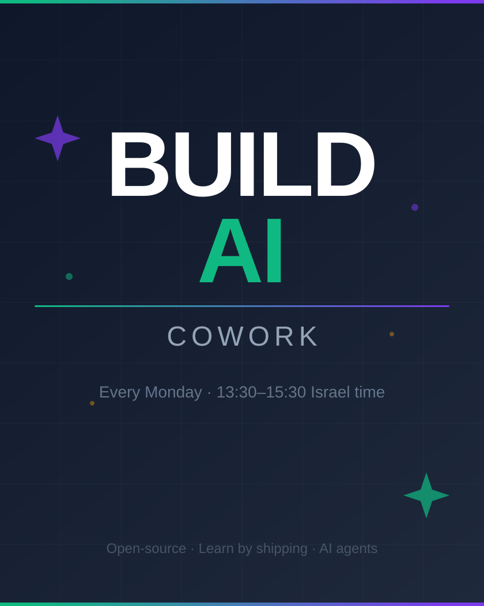

# Build Cowork

Build Cowork is the weekly working space of [Build](https://github.com/The-Last-Founder/Build), an open-source learn-by-shipping community for people building with AI agents. Bring any task and use the shared space for focus, support, consultation, or collaboration.

The space is community-held, opt-in, and shaped by the people who show up.
There is no attendance commitment, required project, or pressure to perform.

## Join

- **When:** Mondays, 13:30–15:30 Israel time. Join for all or part of the session.
- **Calendar and meeting details:** [Add Build Cowork to your calendar](https://evt.to/0dtfw6mh3gh2)
- **Community chat:** [Join the Build WhatsApp group](https://chat.whatsapp.com/DgKpG63438y8N7D3pHJ57t)

## Choose your mode

0. **Skip.** Not joining is completely fine. No explanation needed.
1. **Work on your own thing.** Code, writing, taxes, administration, AI, or anything else.
2. **Ask and help.** Consult the group about AI, agents, products, or building, and help others when useful.
3. **Join a community project.** Contribute actively, start a project room, or simply observe and learn.

**Community projects are open source, recorded and viewable later.**

No preparation is required. You may switch modes, arrive late, leave early, or work silently.

## Typical session

- Brief welcome, setup, and project overview
- Choose your mode or project room
- 45-minute focused work block
- Optional 5-minute check-in
- 45-minute focused work block
- Short checkout: learnings and next actions

This is supportive structure, not a rigid ceremony. Participants can suggest or host project rooms.

## Community projects

The exact projects change. GitHub is the source of truth:

- [Browse all organization repositories](https://github.com/orgs/The-Last-Founder/repositories)
- [Quest Board](https://github.com/The-Last-Founder/quest-board), a project gallery and coordination system
- [Johnny](https://github.com/The-Last-Founder/Johnny), a WhatsApp-native AI teammate for small teams
- [Current project board](https://github.com/orgs/The-Last-Founder/projects/1)
- [Open Build issues](https://github.com/The-Last-Founder/Build/issues)
- [How to contribute](CONTRIBUTING.md)

New project ideas and small experiments are welcome. The person doing the work generally has autonomy over how.

## Recordings

Some shared segments and project rooms are recorded for documentation and learning. Recording is announced, and participation is always optional. You can join as an observer or catch up through recordings and notes when they are published here.

## Start your own!

Do you want additional cowork hours at other times?
Optionally - send a poll, announce it, and do it!
