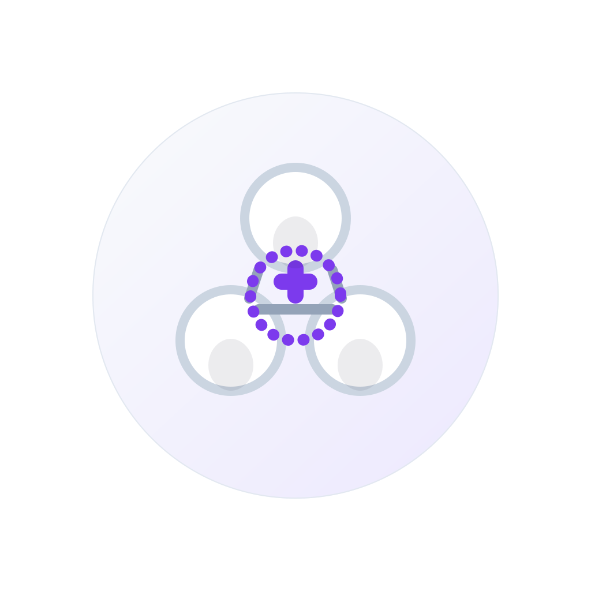

# WhatsApp group icon concepts

Five square icon concepts for the Build WhatsApp group live in this folder.

## Specs

- Format: SVG
- Dimensions: 1024×1024
- Crop target: designed to survive WhatsApp's circular crop with a centered safe area
- Style: minimal, calm, collaborative, slightly game/quest-inspired

## Variants

1. `build-whatsapp-icon-01-quest-board.svg` — quest-board grid with one highlighted tile
2. `build-whatsapp-icon-02-party-formation.svg` — three collaborators orbiting an open slot
3. `build-whatsapp-icon-03-blueprint.svg` — project brief / blueprint with a completion mark
4. `build-whatsapp-icon-04-launch-path.svg` — path from join point to shipped quest spark
5. `build-whatsapp-icon-05-builder-spark.svg` — two build blocks under a shared spark

## Previews

### 1. Quest board

### 2. Party formation

### 3. Blueprint

### 4. Launch path

### 5. Builder spark

